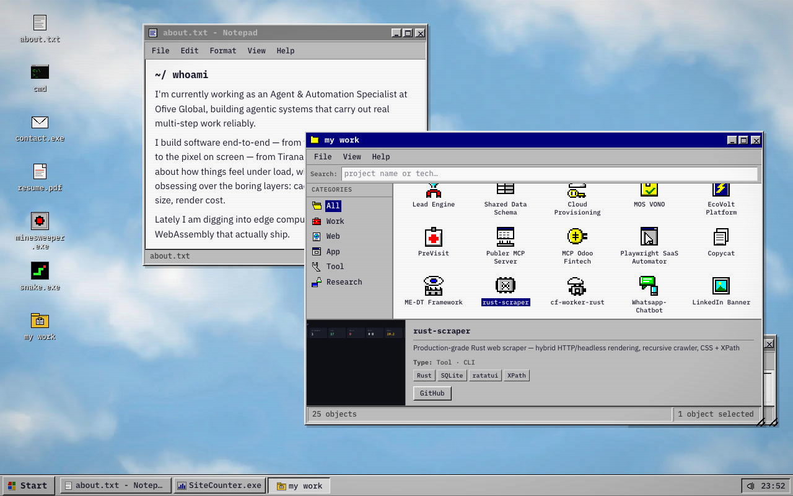

# islibasha.dev

Personal portfolio of **Isli Basha** — Agent & Automation Specialist at Ofive Global, Tirana — built as an interactive **Windows 95 desktop simulation** in React 19.

**Live: [islibasha.dev](https://islibasha.dev)**



## What's inside

**Desktop (Win95):**

- BIOS/memory-check boot sequence, draggable and resizable windows, a taskbar that minimises and restores them
- The full Start menu tree — Programs, Documents and Settings fly-outs, Find, Help, Run and Shut Down
- Display Properties on the desktop's right-click Properties: four wallpapers with live preview, and the boot-sound switch it shares with the tray speaker
- DOS-style terminal (`cmd`) with real commands
- Playable Minesweeper and Snake
- `my work` explorer with 25 projects, `resume.pdf` viewer, contact window

**Mobile (Nokia 3310):**

- On phone viewports the site becomes a Nokia 3310 — LCD chrome, boot intro, monochrome dithered screens
- Playable Snake II, Space Impact, and Bantumi

**AI discoverability:**

- [`/llms.txt`](public/llms.txt) machine-readable site summary for AI assistants
- Static pre-rendered content inside `#root` so non-JS crawlers see a real page
- JSON-LD structured data; AI/LLM crawlers explicitly allowed in `robots.txt`

## Stack

React 19 + Vite, hand-rolled Win95 CSS (no UI library), Vitest (796 tests).

## Run it

```bash
npm install
npm run dev      # local dev server
npm test         # run the test suite
npm run build    # production build (pre-dithers screenshots, regenerates static SEO)
npm run lint     # eslint, zero problems expected
```

Two build steps are run by hand rather than from `prebuild`, because their
outputs are committed and neither encoder is a dependency of this repo:

```bash
node scripts/build-screenshots.js   # assets/screenshots/*.{jpeg,png} -> public/*.webp
node scripts/build-wallpapers.js    # the desktop photo -> WebP + 16-colour PNG
```
